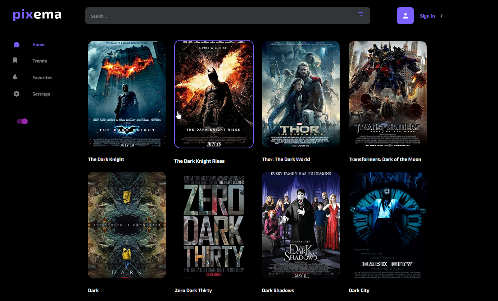
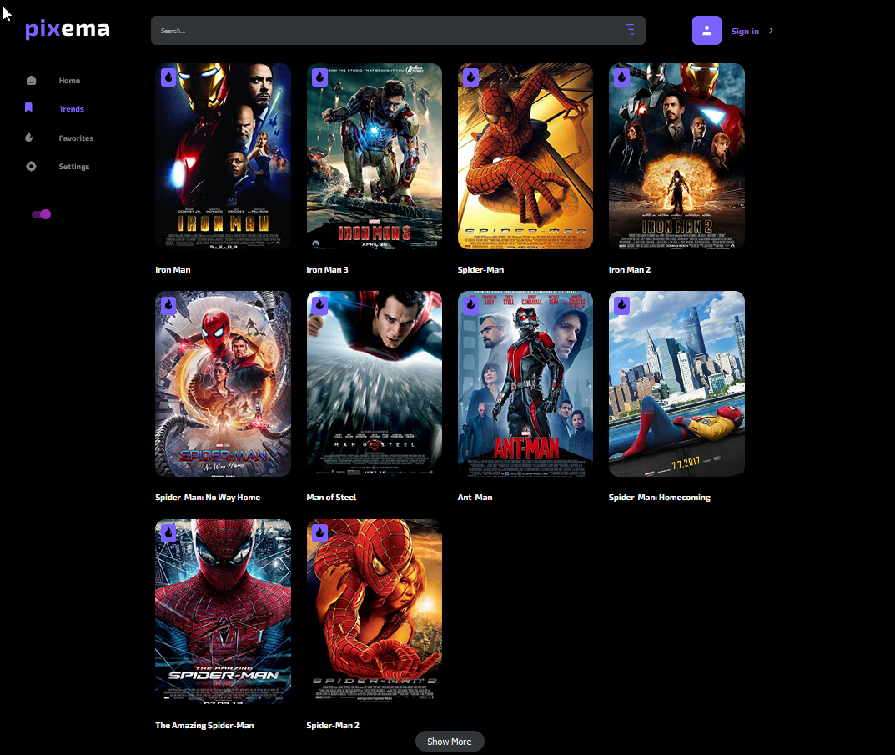
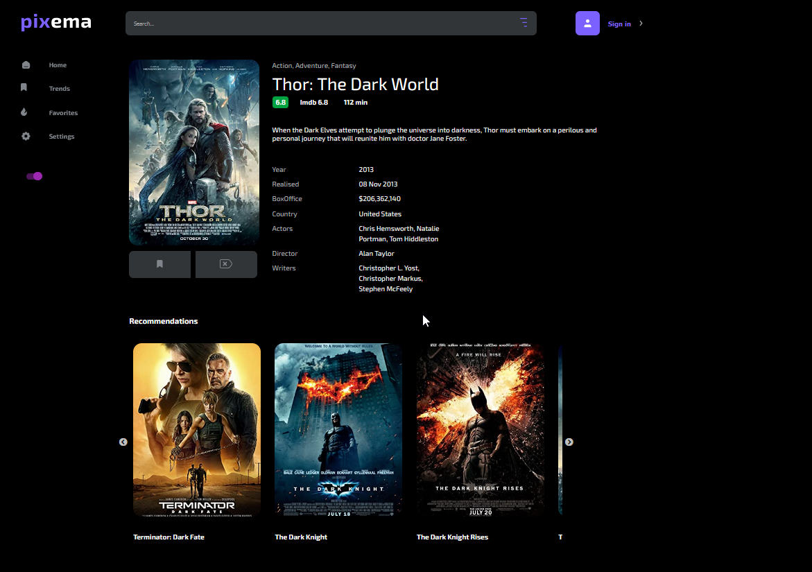
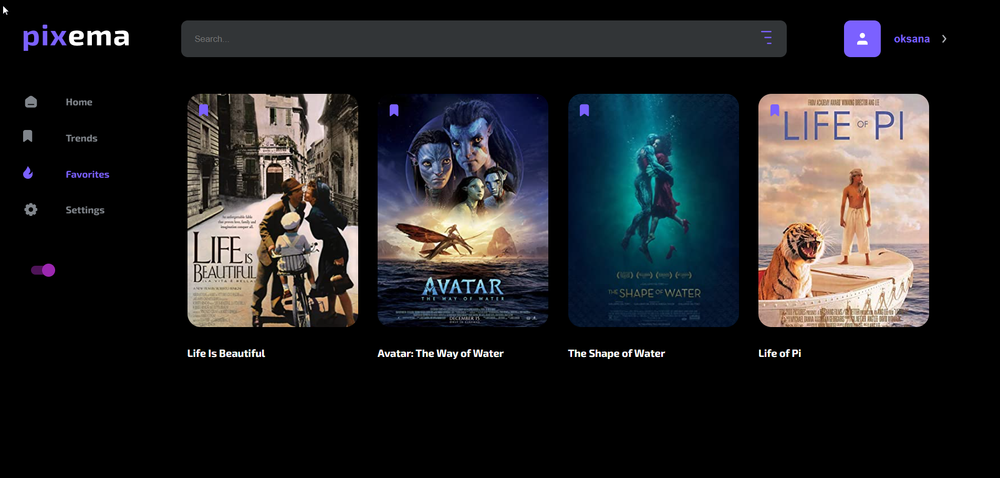
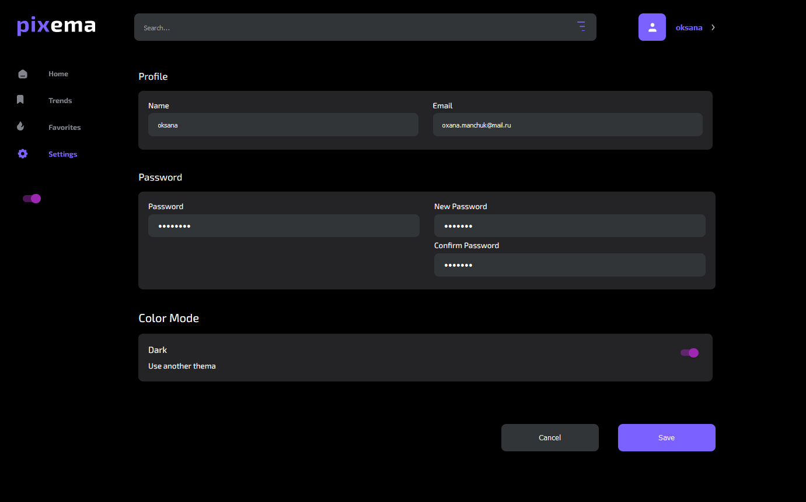
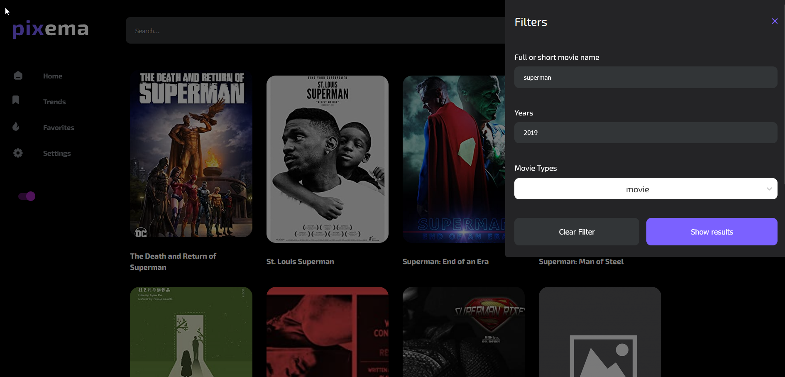
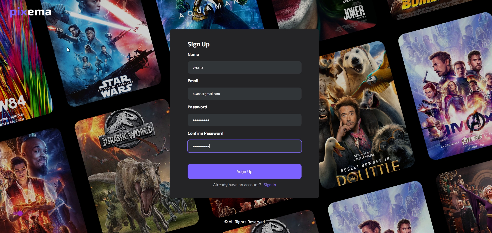

<!-- PROJECT LOGO -->
<div align="center">
<br />
<a href="https://github.com/oksanaweb/pixema">
    
  </a>
   <h3 align="center">PIXEMA</h3>
  <p align="center">
    Your personal movie advisor, helping you find the perfect film to watch!
    <br />
    <br />
    <!--  -->
    <a href="https://oksanaweb.github.io/react-pixema/"> Click here</a> and start searching!
    <br />
  </p>
</div>

<!-- ABOUT THE PROJECT -->

## About The Project

Pixema is a platform that offers a vast collection of movies and shows, including feature films, documentaries, anime, and more. With Pixema, users can search their favorite movies and shows anywhere, at any time. Whether you are looking for the latest blockbusters or old classics, Pixema has something for everyone. The platform also allows registered users to add movies to their favorites. With Pixema, you can explore a world of entertainment and never run out of options.

### Built With


<!-- GETTING STARTED -->

## Getting Started

To get started use the `npm start`.

### Prerequisites

To install all libraries use the `npm install`.

### Installation

If you want to use the local copy:

1. Clone the repo
   ```sh
   git clone https://github.com/oksanaweb/react-pixema
   ```
2. Install NPM packages
   ```sh
   npm install
   ```

## Usage

After loading the site, you get to the Mainpage of the Pixema site.



On the trends page you will see that movies that are currently trending among movie lovers.



By clicking on a movie card, you can access comprehensive details about the selected film, including recommended similar movies. For registered users, the option to add the movie to their favorites is available.



If you sign up, you can add any movies to your favorites and see all of them on favorites page.



The Settings page allows you to modify your personal details such as your name, email, and password. Additionally, you have the option to customize your user interface by selecting your preferred theme between light and dark modes.



By opening the filters, you can narrow down your search for a movie by entering its title, release year and type of movie(series, movie, episode).



This is how the user registration page looks like. It is important to note that the favorite movies and settings pages are only available to authorized users.



<!-- CONTACT -->

## Contact

Aksana Manchuk
<br />
Email: oxana.manchuk@mail.ru
<br />
LinkedIn: [https://www.linkedin.com/in/oksana-manchuk/](linkedin)
<br />
Project Link: [https://github.com/oksanaweb/react-pixema
]

<p align="right">(<a href="#readme-top">back to top</a>)</p>

<!-- MARKDOWN LINKS & IMAGES -->
<!-- https://www.markdownguide.org/basic-syntax/#reference-style-links -->
